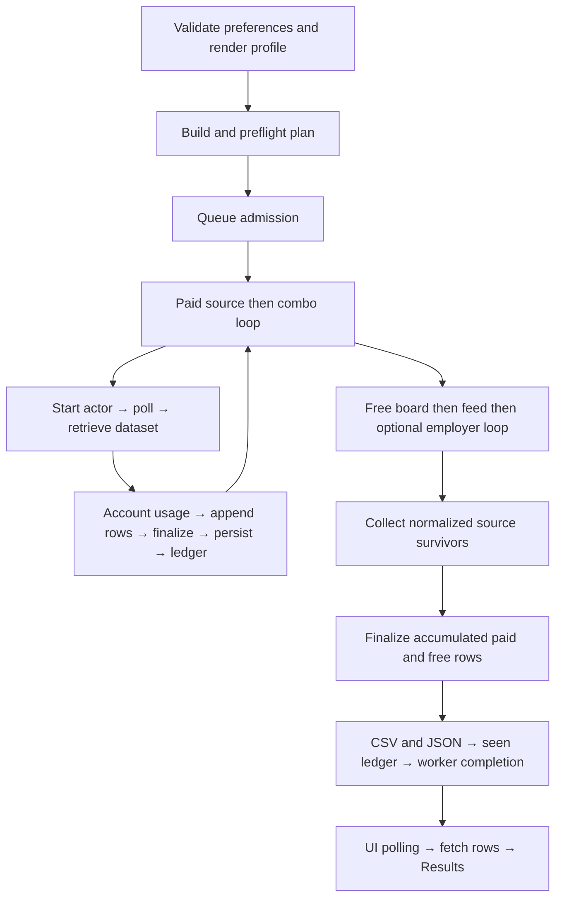

# Search Engine V2 — forensic audit

Audit date: 2026-09-21. Code baseline: `9dc67cc33f99e5d87bd224498bafd0a336354a4f`.
Audit/research only: no production changes, deployment, actor starts, or paid credit use.
Profile Engine V3, extraction, role generation, title gates, scoring, preferences,
and the disabled experience-mismatch guard remain unchanged.

## Findings to review first

- **Free baseline:** 134 active records; 132 returned jobs, two failed. The
  bounded census took 376.559s, including 330.719s inside HTTP boundaries;
  this is an audit probe, not deployed Sweep timing.
- **Expansion:** 15,798 additional candidate IDs discovered; 365 endpoints
  tested, 187 nonempty. Their 8,047 rows add only six positive-score jobs in
  the synthetic full-stack India replay. Start with eight shadow-validation
  boards; a ninth promising board has a sample job-page 403.
- **Paid:** defaults schedule 90 serial actor starts, intending 1,350 rows;
  current estimate $6.966 is not a guaranteed cap. Published LinkedIn input
  fields differ from the code; the spend guard cannot reserve/limit the next
  actor's charge.
- **Latency and recovery:** Free persists only after all sources return;
  WWR loses its earlier category rows when the last configured route fails.
  Paid repeatedly re-scores every accumulated row and discards runtime logs
  in the worker. Exact production 10–15 minute attribution remains UNKNOWN.
- **Identity:** location/URL-distinct jobs can collapse by company/title;
  requisition IDs lack an employer namespace. Audit evidence must preserve
  native IDs/provenance before changing dedupe or widening execution.

## Evidence and limits

**MEASURED** means a reproducible local experiment or a dated public HTTP probe.
**VERIFIED** means directly observed code or provider documentation.
**INFERRED** means a model or hypothesis with assumptions stated.
**UNKNOWN** means evidence is unavailable, not zero.

This traces the production entry points in the checked-out revision. The deployed
Oracle/Render revision and live production run distribution were not inspected;
do not interpret local probe latency as production latency. Historic comments
and logs are explicitly weaker evidence than a current measurement. Free Sweep's
importance is the product premise supplied for this audit; its share of traffic
cannot be calculated from this checkout.

Companion: [Free source expansion audit](free-source-expansion-audit.md).
Implemented first stage, with the findings it confirmed, extended and
corrected: [V2-A telemetry and shadow](search-engine-v2-a-telemetry-and-shadow.md).
No conclusion below was edited; that document's §19 records every divergence.
Reproducible evidence: [paid plans](search-v2-evidence/paid-plans.json),
[paid execution research](search-v2-evidence/paid-engine.md),
[identity experiments](search-v2-evidence/identity-counterexamples.json).
The exact inventories, endpoint probes, coverage and tranche measurements are
linked in the companion document. Public descriptions are used transiently for
local replay; no résumé, token, or full JD is committed in evidence.

## 1. Actual request-to-result path

Every row below is **VERIFIED code**, unless explicitly marked otherwise. A dash
in the retry/timeout column means no explicit boundary here, not infinite safety.

| Stage / file and function | Input → output | Order / network | Failure, retry and timeout | Budget effect |
|---|---|---|---|---|
| `sweep/app.py:1990 configure_post`, `:2103 run`, `:897 commit_prefs`; `sweep/logic.py:1065 _configure_overrides` | Submitted preferences + approved derived profile → validated state | Local, ordered | Invalid form 400; renderer must succeed before state commit | No actors |
| `sweep/app.py:2800 _prefs`; `auto-apply/make_profile.py:1071 render` | State → Python literals for SEARCH/SITES/SCORING/SETTINGS/title gates/feed queries | Local, serial | Unknown config keys/geographies rejected | Determines multiplicative plan and per-search intended depth |
| `config.py:1099 _overlay` and profile loader | Default config + rendered module → one-level dictionary merge/list replacement; regexes compiled at scraper import | Local, serial | Invalid profile/schema fails closed; omitted fields inherit; empty dictionaries clear | Effective site selection and filters |
| `sweep/worker_link.py:124 fetch_plan`, `worker_client.plan`, `deploy/sweep_worker.py:634 price_plan` | Derived profile/preferences → throwaway profile → scraper dry-run JSON | Render→Oracle HTTP, then local subprocess | Client 20s vs worker subprocess 120s; no client retry. Free may fall back to zero-cost empty plan; paid refuses unknown plan | No actor starts; local CPU and round trips still exist |
| `sweep/plan.py:34 cost`, `app.py:2103 run` | Concrete plan → depth-scaled estimate, spend cap, consent checks | Local; paid account reads | Free refuses priced plan; missing plan refuses; concurrent launch lock; over-cap acknowledgment required by existing UI | Estimate is not reservation or hard actor charge limit |
| `worker_link.start_sweep`, `worker_client.py:88 create_run`, `deploy/sweep_worker.py:671 create_run` | Profile/preferences/free flag → unique run ID, profile file, status | HTTP then disk, serial | Validates literal profile; free forcibly disables paid sites; token held only in memory; 20s client timeout, no idempotency key or automatic retry | Paid only uses visitor token; a lost response can leave an accepted run |
| `deploy/sweep_worker.py:390 Queue.submit/:397 _pump/:411 _start` | Queued run → scraper subprocess | FIFO `MAX_ACTIVE=1`; one active Sweep | No overall Sweep deadline. Spawn failure marks failed; running restart marks interrupted | Queue delay consumes wall time, not actor credits |
| `scraper.py:1950 main`, `:1019 resolve_sites/:1034 plan_for_site/:991 build_search_plan` | Effective config → site-specific query×location (+company) plans | Local, insertion order | Empty plans dropped; preflight builds every actor input before paid work | Default plan 90 actor runs; Free has no paid combos |
| `scraper.py:940 build_input/:1067 effective_search/:1118 scrape_search` | One combo → actor start, poll, dataset rows, normalized rows | Paid sites and combos serial | Actor timeout 5min; polling deadline 360s; polling every 5s; exceptions isolated per combo; SDK transport retries differ from actor retry | One actor start per logical combo; requested depth is provider contract dependent |
| `scraper.py:2123` paid loop → `:2056 emit` | Successful search rows → accumulated raw rows, repeated finalization, CSV+JSON, done ledger | Serial local after each completed search | Write failure enters combo exception; checkpoint before ledger; no atomic two-file commit | Duplicate/filtered paid rows have already consumed spend |
| `scraper.py:278 fetch_free`; `sources/__init__.py:34 fetch_free` | Registry + candidate title/location predicates → all source survivors | ATS boards then enabled feeds then optional Optum/enterprise; serial HTTP | Exception per board/feed; HTTP helper retries transient failures twice (3 attempts), sleeps 1+2s, socket timeout 25s; no retry on 4xx including 429 | Zero Apify; requests, bandwidth, CPU, memory, time still consumed |
| `sources/ats.py:111 fetch/:96 _row` | Public whole-board JSON → normalized rows → title/location survivors | Local following one list request | Missing list can become empty; malformed items can fail whole board; no pagination loop for SmartRecruiters | Whole inventory downloaded; ID/date/salary information may be discarded |
| `sources/feeds.py`, `enterprise.py`, `optum.py` | Feed/category/query/page or employer index+details → normalized survivors | Serial pages, queries and details | Provider-specific catches; whole-feed exception may discard earlier local rows; detail failures may preserve partial results | A registry record is not one HTTP request |
| `scraper.py:620 score_job` | Normalized rows → blocked-company/title/experience drop or scored/enriched row | Local, serial | Optional experience guard remains off; no network | All repeated raw rows scored on every checkpoint |
| `scraper.py:1260 finalize` | Scored rows → min-score → recency → salary → reachability/visa/EOR → arrangement/geography → sort → dedupe → output rows | Local, serial | No profile-independent eligibility guarantee; unknown date/pay/location can survive existing rules | Dedupe happens after scoring and hard filters |
| `scraper.py:1377 write_outputs/:1361 record_seen`; `merge_jobs.py` | Ranked rows → CSV/JSON, then seen ledger; optional separate historical merge | Local disk | Full file rewrite; no atomic rename. Seen appended only on normal final completion. Resume does not load old checkpoint rows into new raw accumulator | Repeated serialization cost grows with accumulated inventory |
| `deploy/sweep_worker.py:522 rows_since`; `worker_client.py:136 all_rows`; `app.py:655 live_feed` | Latest CSV → 500-row pages → up to 5000 rows → UI feed/results | HTTP on each paid progress poll | Read/CSV errors return empty; paid UI suppresses shrinking counts. Pagination reads a mutable sorted snapshot | Up to 10 worker page calls per paid poll plus status; CSV fully parsed for every page |
| `app.py:711 snapshot/:771 _liveness`; `templates/running.html:49` | Done ledger + process liveness → progress/state/navigation | Public polling every 4s after response; local SSE 2s | Free has no ledger/progress percentages and deliberately no live-feed read. Public completion redirect adds 1.2s | Poll overhead and queue delay belong in UI TTFR |
| `sweep/logic.py:801 shortlist/:1218 bucket_rows`, `sweep/exports.py` | Persisted ranked rows + user display filters → visible/exported shortlist | Local; remote results fetch first | Display filters/sort can reduce final visible inventory | Final engine count is not necessarily displayed count |

The actual funnel differs from the requested analytical ordering: Free title and
location filtering occurs inside adapters; scoring happens before most final
hard filters; global dedupe comes near the end. Instrument the actual edges and
also emit an analytical funnel, without moving gates or changing results.

## 2. Paid plan, capacity and costs (phases 14, 16, 21–22)

The [offline harness](../bench/search_v2_paid_audit.py) invokes the real planner
and input builders with synthetic lowered configuration. It blocks sockets and
does not generate a résumé or run an actor. Every concrete query, location,
country, remote flag, recency, limit, actor and input is in the JSON artifact.

| Case | Actor starts if all execute | Intended row capacity | Current code estimate, USD |
|---|---:|---:|---:|
| Repository defaults | 90 | 1350 | 6.966 |
| Software/full stack | 8 | 120 | 0.468 |
| React Native | 8 | 120 | 0.468 |
| Business/Salesforce, explicitly enabling Naukri | 18 | 480 | 3.702 |
| Multiple roles/locations, explicitly enabling Naukri | 40 | 880 | 5.872 |

These are **MEASURED OFFLINE**, not typical-user frequencies, invoices, maximum
cost guarantees, or measured useful yield. Naukri is disabled in defaults.
The [paid research](search-v2-evidence/paid-engine.md) documents provider-specific
pricing, batching, timeout/retry, exact plan dimensions and historical caveats.

**VERIFIED contract discrepancy:** Sweep passes LinkedIn `count`; the currently
published actor schema advertises `limitPerSource`. Current documentation also
describes automatic AI-search conversion, with implications for classic URL
filters. The actor build actually used by a past production run is unavailable.
Do not assume the intended 15-row depth or remote/experience filters are enforced
by today's mutable actor. See the [publisher's input schema](https://apify.com/curious_coder/linkedin-jobs-scraper/input-schema).

The budget guard checks accumulated spend **before the next search**, after
charges from the previous one. It does not reserve the next actor's maximum
charge, pass a verified maximum charge per run, or abort a started actor on
crossing the Sweep cap. Account month-to-date deltas include unrelated activity;
actor self-reported fallback may omit charged events. Failure before the
post-search usage read can leave spend stale. Accordingly cost/raw,
cost/source-unique, cost/eligible and cost/displayed are **UNKNOWN for current
runs**, until per-run charge evidence and the matching row funnel are joined.

## 3. Time and first useful result (phases 11, 15, 25)

Measure distinct clocks: request accepted, queue entered, process started,
first HTTP response, first raw row, first eligible row, first checkpoint,
first browser-visible row, completion. Report first 1/5/20 useful jobs and
25/50/90% of final useful inventory; source-count percentage is a different metric.

**VERIFIED:** Free inventory stays in adapter/collector memory until all free
sources finish, and `emit` runs twice at the tail (free checkpoint and final
write). Engine *persisted* TTFR is therefore near completion, even if a useful
raw job arrived at the first board. The Free running page explicitly skips
`live_feed`; its first visible result is the Results page after completion,
poll latency, the 1.2s redirect, row transfer and rendering. No browser timing
or production queue trace was captured, so actual UI TTFR is **UNKNOWN**.

Paid emits after every successful actor dataset completes, but it re-scores,
sorts, dedupes and serializes the entire accumulated raw set each time. If each
of K searches adds m rows, scoring visits approximately `m*K*(K+1)/2` rows,
plus Free and final passes. This is a **VERIFIED algorithmic cost**, not evidence
that local scoring dominates network time.

Historical operational documentation reports 171s wall, 6s CPU and 262MB peak
for one worker run on 2026-09-15 (`docs/oracle-sweep-worker.md:20`). Its profile,
source mix and raw trace are not reproducibly joined here. Treat as **historical
reported measurement**, not a benchmark for this revision or expanded registry.
The current public-source probe timings are in the Free report. They do not
establish where a reported 10–15 minute production Sweep spends its time.

## 4. Identity and duplicate waste (phases 17–20)

`scraper.job_key` (`:775`) applies, in order:

1. `('req', lower(req_number))`, without company/provider namespace.
2. `('ct', normalized_company, sorted_normalized_title_words)`.
3. Only if company/title is absent: URL host + lowercased path, dropping query,
   fragment and trailing slash; `www.` removed.
4. No usable key: retain each row.

Company normalization strips stacked corporate suffixes, including broad words
such as “labs”, “software”, “systems” and “technologies”. Location, posted date,
most native ATS IDs and different apply URLs do not distinguish company/title
matches. Stable score sort keeps the highest-scored member; score ties preserve
source arrival order. Reposts with the same company/title collapse. Multi-city
distinct requisitions without `req_number` can disappear; the same URL under
different company/title text can survive twice. Cross-provider aliases without
an explicit map can miss duplicates. Req numbers from different employers can
collide because the key has no namespace.

**MEASURED synthetic:** [six executable counterexamples](../bench/search_v2_offline_audit.py)
show two distinct-city/distinct-URL jobs collapsing to one; same req across two
employers collapsing; same URL/different title remaining two; URL query-only job
IDs collapsing; distinct requisitions surviving; and unkeyed rows surviving.
These prove behavior, **not real-world prevalence**. The Free measurements report
both endpoint identity and current engine heuristic identity where available;
neither should be described as perfect opportunity identity.

Attribution required to measure waste by response/query/location/page/board/
provider/Free-vs-Paid: preserve provenance for every observation before dedupe,
including original provider ID, canonical URL and work-unit ID. Current paid
rows preserve some query/rank metadata, but global winner-only exports cannot
recover rejected raw rows or all losing provenance. Baseline-vs-expansion
overlap measured in this audit is snapshot-specific. Live Free-vs-Paid overlap,
query marginal yield, page marginal yield and actual wasted paid credits remain
**UNKNOWN** without joined raw/dataset traces. Do not rank Naukri last on quality
merely because it is disabled or absent from a historical export.

## 5. Dependencies and potential concurrency (phase 23)



| Work | Classification | Wall-time opportunity and risks |
|---|---|---|
| Render → import config/compile scoring → plan | MUST SERIAL | Dependencies and profile correctness; negligible expected network benefit |
| Start → poll → dataset for one actor | MUST SERIAL | Need run/dataset IDs; pagination continuation depends on provider contract |
| Paid combos across queries/locations/providers | SHARED BUDGET/STATE | Could overlap remote waiting, but simultaneous spend, stale account deltas, mutable actor contracts, output/ledger races and attribution must be resolved first |
| Independent ATS boards | SAFE PARALLEL at data level, provider limits UNKNOWN | Could reduce sum-of-waits; same-host request limits, response memory, fairness and deterministic tie order require bounds and evidence |
| Feed pages / employer details | UNKNOWN or MUST SERIAL | Cursor/total discovery must precede continuation; independently addressed details potentially parallel but rate limits and retries need contract-specific review |
| Normalize independent completed responses | SAFE PARALLEL in principle | Current Python CPU benefit unmeasured; memory/copy cost may exceed benefit |
| Global scoring/rank/dedupe/checkpoint | SHARED STATE | Single deterministic merge or immutable snapshots needed; completion-order changes tie winners |
| Separate Sweeps | SHARED worker capacity | `MAX_ACTIVE=1` is job admission, not a requirement that every internal request stay serial |

No concurrency was added to production. No speedup factor is promised. First
collect per-boundary timings and provider failure/rate-limit data; any future
bounded experiment must cap simultaneous spend and preserve deterministic
source order, progress semantics and failure isolation.

## 6. Failure isolation and persistence (phase 24)

| Failure | What survives / retry behavior |
|---|---|
| One ATS board 404/schema/timeout | Other boards proceed. Current board contributes nothing. Transient HTTP retries only; 404/429 no retries. One stalled request can cost roughly 3×25+3 seconds under simple socket-timeout assumptions; this is not a strict whole-response deadline |
| Feed fails on a later category/page | Caller catches at feed boundary; rows held only inside that feed may be lost. Specific adapters also catch internally; see Free family audit |
| Optional enterprise employer/detail | Employer isolation and some per-detail skipping; already returned other employers survive in memory |
| Paid actor/query/location fails | Exception recorded only in console list, later combos proceed; no done marker. Dataset partial rows are not retained if `scrape_search` never returns |
| Paid budget exhausted | Stops launching later paid combos; Free phase still runs. Cost already incurred is not recoverable |
| Stop/crash during Free | No per-board disk checkpoint. Successful earlier boards can be lost and refetched on new run |
| Stop/crash after paid checkpoint | Previous CSV/JSON survive, subject to torn write. Same-output rerun skips today's done combos, but starts `raw_rows=[]` and does not reload previous results. New file alone is not a merged resumed shortlist |
| Public worker restart | Running → interrupted; queued Free requeues; queued Paid interrupts because credential is intentionally not persisted. A new public run gets a fresh output directory/ledger and can repeat already-paid work |
| CSV/JSON write failure | No atomic snapshot pair; CSV reader can see partial data; ledger is appended only after emit but no transaction joins all three files |
| Partial paid failures with some rows | Engine can exit 0; worker labels done by exit code. Remaining paid done-combo tiles can show interruption, but structured provider failures are absent |
| All free boards fail / all source-gated inventory empty | `pulled==0` exits nonzero; worker knows failure, but Free UI `_liveness` has zero outstanding combos and derives “finished” without checking exit code. Distinguish a worker state from UI completion |

Free success, legitimate zero jobs, schema-empty response, filtered-to-zero and
failed request must become different telemetry states before automatic source
cleanup. A single failed probe is not proof of a dead employer.

## 7. Minimum measurement contract (phase 26)

No production telemetry was added. Proposed audit/V2-A record:

```
sweep_id, policy_fingerprint, engine_revision, adapter_version,
path_free_or_paid, provider, board, work_unit_id, query_id, location_id,
queue_entered_at, process_started_at, started_at, finished_at, duration_ms,
actor_id, actor_build_id, actor_run_id, dataset_id,
requested_limit, request_count, response_bytes, retry_count,
raw_count, normalized_count, source_gate_count, unique_source_count,
unique_global_count, fresh_known_count, date_unknown_count,
location_valid_count, hard_filter_count, reachable_count, scored_count,
final_count, displayed_count, duplicate_count,
failure_type, partial, estimated_cost, actual_cost_if_known,
first_raw_ms, first_eligible_ms, first_checkpoint_ms
```

Use monotonic durations plus UTC timestamps; separate HTTP attempts, actor
startup/running/retrieval and local normalization/filter/rank/serialization
spans. Record filter reasons before discarding rows, and measure 1/5/20 and
25/50/90% after completion so the denominator is explicit. Browser visibility
requires a separate UI event; file mtime is not UI TTFR. Record peak RSS and
bytes, not just Python allocations. Failed/zero denominators yield null ratios.
Record immutable observation IDs so early dedupe alternatives can be replayed
without changing production ranking.

Keep tokens, résumé text and private preference payloads out of telemetry.
Use opaque policy/query IDs with access-controlled audit fixtures rather than
unnecessary personal strings. Do not store full JD text in operational logs.
Public inventory storage has a separate retention/terms policy.

Current gaps: no per-board timestamp/history, no request/byte accounting, no
full rejection funnel, no native ATS IDs in common rows, no actor startup vs
running split, no trustworthy per-work-unit billed cost, no browser TTFR, no
cross-source losing provenance, no cached-inventory metrics, and no joined
production population to determine “normal” plan/traffic distribution.

## 8. Options and reversible sequence (phase 27)

The Free report supplies expansion evidence and cache/registry models. Expected
gains below are **INFERRED** unless a measured tranche is linked; none weaken
candidate relevance/eligibility. Sizes: S = a bounded isolated change, M = a
cross-module change, L = new lifecycle/storage behavior; these are not dates.

| Option | Problem / evidence | Unique useful gain | Latency / cost effect | Size; maintenance | Correctness/provider risk; rollback |
|---|---|---|---|---|---|
| Telemetry and frozen offline benchmarks | Missing joined timings/funnel/charge trace | No direct inventory gain | Small overhead, unlocks attribution | S–M; low | Redaction/schema discipline; disable instrumentation |
| Actor contract verification/version pinning | LinkedIn field/schema drift; intended caps unverified | Unknown until matched-run test | May prevent excess retrieval/spend; no guaranteed savings | S–M; ongoing contract review | Mutable provider semantics; restore pinned known build/input |
| Source health triage | Live probe failures and ambiguous zero states | Protects coverage rather than guaranteed increase | Can avoid repeat timeout tail | S; scheduled checks | False disabling loses rare useful roles; reversible enabled flag |
| Expand current adapters | Validated candidate inventory, existing family code | Measured snapshot proxies in Free report; true eligibility requires frozen replay | More requests if fetched per user; zero Apify | S for curated tranche; moderate curation | Duplicate boards/identity/date gaps; registry-only revert |
| New reusable families | Structured documented interfaces | Unknown until live sample + overlap replay | Adds calls/storage; zero actor if public | M; provider specific | API access/terms/schema; feature flag family |
| Public inventory cache | Repeated identical whole-board retrieval | Same inventory within freshness tolerance; not free extra relevance | Potentially large shared request savings at reuse; hit rate unknown | M; freshness/refresh lifecycle | Must cache before personal filtering and hires-home computation; bypass cache |
| Identity-aware early duplicate work removal | Synthetic false merge/missed duplicate cases; repeated scoring | Could recover false merges, but gain unmeasured | Less scoring only after safe identity verification; fetched paid duplicates still cost | M; alias and ID contracts | Highest-score winner must remain identical; shadow comparison and disable |
| Verified source-side filters/batching | Repeated paid actor starts and discarded rows | Must preserve eligible set | Potential startup/cost reduction, current measurement unavailable | M; provider contract upkeep | Batch failure domain/per-query depth/AI filters; return to single combo |
| Bounded concurrency | Serial independent requests | No intrinsic inventory gain | Potential lower wall time, higher memory/simultaneous spend | M; rate limit tuning | Determinism, budget, retries; concurrency=1 |
| Adaptive Free depth/paid budgets | Unmeasured marginal yield and whole-board depth | Unknown; can reduce coverage if premature | Time/cost controls after stable telemetry | M–L; policy tuning | Bias against rare roles/geographies; fixed deterministic plan fallback |
| Incremental persistence/results | Free end-only output; restart refetch | Retains existing work, no intrinsic new inventory | Better TTFR/recovery, additional serialization | M–L; snapshot lifecycle | Partial state and sorted pagination consistency; final-only path fallback |

Recommended sequence:

1. **V2-A:** instrument joins and actor contract checks; replay fixed synthetic
   and approved candidate fixtures with the current frozen eligibility/ranking.
   Include native observation identity for audit, without changing dedupe yet.
2. **V2-B/C:** recheck failing boards, then shadow the evidence-backed first
   expansion tranche. Do not delete a source based on a single probe or a
   software-only score. Approve registry edits separately after this audit.
3. **V2-E:** evaluate a provider-scoped public inventory cache before scaling
   per-user board fetches to hundreds. Recompute candidate predicates locally.
4. **V2-D/F/G:** trial new families, duplicate-work removal and paid batching
   separately, only where matched fixtures and live contract evidence justify it.
5. **V2-H/I/J:** bounded concurrency, adaptive depth and incremental results
   after budget, health and partial-state semantics are measurable. Recovery
   checkpointing may move earlier if measured interruptions dominate waste.

## 9. Paid live validation approval gate

No paid calls were made. Provider schemas can be checked without actor execution.
Actual actor latency/yield/billing requires a separately approved experiment.
The paid evidence document specifies the proposed actor runs and requested
results. The code's estimate is **not an estimated enforceable maximum**, especially
while LinkedIn's limit contract is unresolved. Before requesting spending
approval, attach the current actor build/pricing schedule, a supported hard
charge limit if available, exact inputs and an explicit dollar ceiling. If no
ceiling can be substantiated, say UNKNOWN and do not execute.

Production timing, sustained health, true candidate-relevant marginal inventory,
URL reachability/stable IDs across refreshes, paid duplicate cost, batching
equivalence and actual cache hit rates still require live validation. This audit
ends for review; it does not authorize or perform any V2 implementation.

## 10. Delivery verification

Seven audit-only harnesses parsed successfully; planner and identity assertions
passed with sockets blocked; all evidence JSON and local Markdown links checked;
registry/probe arithmetic reconciled. Public probes and the frozen replay provide
the measurements described above. Tracked production files have no diff. The
evidence [reproduction guide](search-v2-evidence/README.md) separates offline
checks from optional public network probes. No Apify credits were used, and no
deployment or runtime configuration change was performed.
