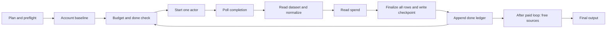

# Paid execution evidence — 2026-09-21

Scope: the checked-out execution path, not a verified deployed revision. No actor was started, no account/token endpoint called, no private profile exported, and no production file changed. **MEASURED** means reproduced offline or read from a historical artifact; **VERIFIED** means source code or current primary documentation; **INFERRED** means a conditional model; **UNKNOWN** requires missing/live evidence.

## Highest-priority findings

1. **VERIFIED contract drift, runtime consequence UNKNOWN:** LinkedIn production sends `count` (`scraper.py:959`), but the current actor input schema documents `limitPerSource`, minimum 1, and an omitted limit can retrieve up to approximately 1,000 jobs/search. It does not list `count`. The code's floor of 10 even names another actor in its comment (`scraper.py:1064`). The current schema also defaults URL conversion to AI search, where classic workplace/experience filters become natural-language search terms. Therefore code's `f_WT`/`f_E` guarantees, depth ceiling, and automatic remote stamping need contract verification before optimization. No paid test was performed. [Actor schema](https://apify.com/curious_coder/linkedin-jobs-scraper/input-schema).
2. **VERIFIED:** the spend guard checks only `spent >= budget` before another run; it does not reserve the next run's cost or pass a server-side charge cap (`scraper.py:2118`, `scraper.py:1135`). A run can overshoot the remaining budget. Failure paths do not refresh spend, and the fallback only sums successful run costs. A failing paid run can therefore consume money without advancing the local guard.
3. **VERIFIED:** paid stdout/stderr are discarded by the production worker (`deploy/sweep_worker.py:281`–302). No per-run timing, actual billed events, actor build ID, dataset ID, startup duration, or failed-run charge survives in worker telemetry. Ten-to-fifteen-minute attribution is **UNKNOWN**, not established by historic comments.
4. **MEASURED OFFLINE:** repository defaults schedule 90 serial actors, intending 1,350 results and estimating $6.966. This is not a measured typical user sweep. Each started search sleeps five seconds before its first status check. The 90-run loop has at least 450 seconds in those initial sleeps; this overlaps actor runtime and must not be added to actor runtime as independent overhead.
5. **VERIFIED:** every completed paid search rescans/ranks all rows accumulated so far and rewrites CSV+JSON (`scraper.py:2056`, `scraper.py:2127`). Dedupe happens after scoring and hard filters (`scraper.py:1324`). Provider-side duplicates are charged and normalized before cross-query/source dedupe.

## Reproduction and artifacts

Run `.venv/bin/python bench/search_v2_paid_audit.py`. It clears process-local token/profile environment values, blocks socket connections, calls the actual planner/adapters and cost function, and runs identity assertions. It never calls `scrape_search` or `main` and cannot spend credits. Runtime configuration is patched in this process only. Generated artifacts:

- `paid-plans.json`: every concrete actor input for five cases; four reusable synthetic `derived`/`prefs` fixtures validated through `make_profile.render`.
- `paid-offline-evidence.json`: synthetic collision results and anonymized numeric log aggregates.

Fixtures are explicit synthetic candidate inputs, not output from résumé extraction or role generation. They test plan shape, not extraction accuracy. Their simple weights/gates are frozen inputs to the existing renderer; they do not alter production defaults. `repository_defaults` uses untouched default SEARCH/SITES. All other cases keep inherited Naukri locations `Delhi / NCR, Remote`; setting generic locations does not override those.

| Case | Keywords | LI runs | Indeed runs | Naukri runs | Intended result capacity | Existing estimator USD |
|---|---:|---:|---:|---:|---:|---:|
| Repository defaults | 9 | 18 | 72 | 0 | 1,350 | 6.966 |
| Software/full stack | 2 | 4 | 4 | 0 | 120 | 0.468 |
| React Native | 2 | 4 | 4 | 0 | 120 | 0.468 |
| Business/Salesforce | 3 | 6 | 6 | 6 | 480 | 3.702 |
| Multiple roles/locations | 4 | 16 | 16 | 8 | 880 | 5.872 |

Software roles: Software Engineer, Full Stack Developer. Mobile roles: React Native Developer, React Native Engineer. Business roles: Business Analyst, Salesforce Functional Consultant, Salesforce Administrator. Multi-role: Software Engineer, Full Stack Developer, React Native Developer, Business Analyst. Software/mobile locations: Bengaluru, Remote. Business: Delhi, Remote. Multi: Bengaluru, Hyderabad, Pune, Remote. In all synthetic cases LinkedIn locations are explicitly overridden too. Default LinkedIn locations are India/Remote; Indeed inherits all eight default places. Exact URLs, geo IDs, country, age window, remote flag, actor, and limits are in the JSON.

Plan cardinality is `sum_s K_s × L_s × C_s`, then a per-site prefix cap if set (`scraper.py:992`–1053). Keyword outer loop means small caps can exhaust locations of early roles before later roles get any exposure. Company filtering only affects LinkedIn; giving `companies` to other sites still multiplies plans while their adapters ignore it. One logical search equals one actor start unless same-day ledger skip/budget/failure prevents start. No current batching. No measured population distribution establishes a normal sweep count.

## Concrete paid path

| Stage / evidence | Input → output | Execution/network | Failure/retry/timeout | Budget effect |
|---|---|---|---|---|
| `auto-apply/make_profile.py:1071` render | derived fields + preferences → literal profile | local, serial | key/value/geo validation rejects malformed profiles | embeds max spend if provided, otherwise inherits default None |
| `sweep/plan.py:16`, worker `:633` | profile → scraper dry-run JSON → estimate | subprocess; worker HTTP for public UI | worker subprocess 120s; finally removes temporary profile | zero actor calls; estimates only |
| `sweep/app.py:1005`, `:2185` | remaining plan + credit headroom → spend cap in profile | local plus credit lookup elsewhere | launch guarded by app lock | plan price is not guaranteed bill |
| `scraper.py:1958`, `:2029` | site toggles + per-site overrides → ordered plans and preflight | local, serial | builds every input; one invalid geo aborts before spend | actor counts fixed here |
| `scraper.py:2090` | token → SDK client + account baseline | network | account read exception becomes None | baseline monthly usage used for aggregate delta |
| `scraper.py:2110` | ordered combo → skip/start | serial | same-day done key; cap checked before start | no next-run reservation |
| `scraper.py:1135` | actor input → remote run | network; start→poll loop | server timeout 5m; client loop deadline 6m begins after start; abort at deadline; SDK retries | actor/event spend begins |
| `scraper.py:1147` | terminal run → dataset | network then local | non-SUCCEEDED raises; partial dataset is not fetched | failure cost not returned |
| `scraper.py:1157`, `:166` | dataset iterator → normalized rows + query/rank | serial network pagination, local normalization | one bad item/iterator exception loses this search's local accumulated rows | downloads entire dataset; no local result truncation |
| `scraper.py:2124` | account delta + rows → accumulated inventory | network then local | failure read falls back to returned cost | account-wide usage may include unrelated actors and billing lag |
| `scraper.py:1260` | accumulated rows → scored/filtered/sorted/deduped output | local, repeated after each success | current hard gates unchanged | rows discarded here have already been paid for |
| `scraper.py:1377`, `:2128` | output files → done ledger | serial local IO | CSV/JSON truncate in place; ledger appended after write | crash between remote completion and ledger may repeat paid work |
| `scraper.py:2159` | all paid searches → free sources → final emit | paid before free; local/network | free work deferred until all paid attempts finish | no actor cost for free inventory |

Paid `normalize` takes the first nonempty alias per field, strips description HTML and caps description text. It does not retain general actor job IDs as identity fields (`scraper.py:77`, `:166`). Paid rows do not pass through the free-source `is_dev_title/location_allowed` acquisition gate; they enter `score_job` and `finalize` directly. Hard title exclusions and existing experience ceiling precede score calculation (`scraper.py:639`). Keep this distinction when interpreting free-versus-paid eligible funnels. No frozen rule was changed.

The installed audit environment has `apify-client 3.1.0`; constructor defaults are 4 retries, 0.5s minimum retry delay, short/medium/long timeouts 5/30/360s. Deployment version is **UNKNOWN** because requirements only say `apify-client>=1.7.0`. A six-minute poll-loop deadline is not a total six-minute bound: start, in-flight retrying HTTP calls, abort, and dataset retrieval lie outside/beyond its checks. SDK retry behavior is documented separately from Sweep's per-search exception isolation. [Python retries](https://docs.apify.com/api/client/python/docs/concepts/retries).

## Current published pricing versus code estimates

These are store prices checked 2026-09-21, not account invoices, and may differ by subscription/build. Free subscription values are used below because the advertised “from” price is discounted.

| Provider | Existing estimate | Current documented Free subscription pricing | Consequence |
|---|---|---|---|
| LinkedIn | $0.045 / 25 = $0.0018/intended row | $2/1,000 results; actor-start $0.00005 per memory GB with minimum one event; platform usage included | 15 results modeled $0.03005 at one start event versus code $0.027. Actual limit currently uncertain |
| Indeed | $0.09 / 15 = $0.006/row | $6/1,000 returned listings, platform included | matches base rate at full depth; fewer returned rows can cost less |
| Naukri | $0.50 minimum inferred from historic comments; fixed depth 50 | standard $1.50/1,000; detail $3/1,000; initialization $0.001; platform included | no $0.50 floor appears in current pricing table; maxJobs minimum 50 remains. Detailed-mode event combination requires billing validation |

Sources: [LinkedIn pricing](https://apify.com/curious_coder/linkedin-jobs-scraper/pricing), [Indeed pricing](https://apify.com/misceres/indeed-scraper/pricing), [Naukri pricing](https://apify.com/muhammetakkurtt/naukri-job-scraper/pricing).

For Naukri 50 rows, full detailed charge is $0.151 if only detail events fire, or $0.226 if standard and detail events both fire once per row. These are conditional event models, not a verified maximum or a refund promise. The code's `fetchDetails=True` is material. Historical comment “Naukri never executed” (`config.py:93`) is contradicted by retained historical logs reporting Naukri runs and rows; that comment's inventory scope is narrower than all local evidence. It must not justify removing Naukri or ranking it as zero-yield.

Actor start fees are tiny on these published schedules: batching would mainly target latency, repeated inventories, and HTTP/control overhead. Removing 17 LinkedIn starts saves approximately $0.00085 at one start event each, before any difference in results. Billing duplicates and subsequently filtered rows remains ordinary returned-result spend unless the actor avoids emitting them. Pagination cost is not priced as a separate event in these tables; page count still affects time and provider capacity. Failed runs may have already emitted charged events; precise failed-run billing is **UNKNOWN** here.

`account_usage_usd` comments describe a historical 84-run comparison ($0.53 run reports vs $1.61 account change). That is historical code commentary, not remeasured causality. The current actor pricing pages include platform costs; attributing the entire old difference to platform charges would be unsupported. Account-wide delta is not per-run attribution, and fallback `usage_total_usd` alone ignores event-level accounting. Preserve `chargedEventCounts`, pricing/build snapshot, actor usage, account before/after, and invoice reconciliation separately.

## Filtering and batching contracts

| Provider | Present production filters | Documented batching | Limits/correctness risks |
|---|---|---|---|
| LinkedIn | query, geoId, optional company f_C, f_WT=2, f_E, f_TPR; scrapeCompany false | multiple URLs supported | new limitPerSource contract and AI conversion must be verified; preserving per-query provenance/rank is required |
| Indeed | scalar position/location/country; unique-only true; no recency/work-mode field | multiple startUrls supported; each URL has maxItemsPerSearch | keyword plus URLs execute independently, so populating both can duplicate work; raw URL recency/work-mode semantics not verified |
| Naukri | keyword, city ID, remote workMode, freshness rounded up, experience; details true | cities is multi-select; singular keyword/searchUrl | city union under one maxJobs is not equivalent to each city receiving depth 50; loss of query/location attribution and changed ranking coverage |

Sources: [Indeed schema](https://apify.com/misceres/indeed-scraper/input-schema), [Naukri schema](https://apify.com/muhammetakkurtt/naukri-job-scraper/input-schema). Batching capability does not prove equivalent inventory or faster execution. Separate countries/role queries are independent today; combine only where a verified contract preserves per-input depth, eligibility and attribution. Never combine different credentials/accounts in a run.

**VERIFIED filtering gaps:** Indeed receives no age limit; Naukri rounds 14 days to 15; LinkedIn/Indeed broad location searches can return remote work that onsite policy later drops; unmapped Naukri locations print a warning and search all India (`scraper.py:978`); experience and salary controls are not consistently source-side. LinkedIn and Indeed fail preflight for unknown location mappings; Naukri does not. The amount of discarded paid spend attributable to each gap is **UNKNOWN**, because raw per-query rejects are not persisted. Source filtering that approximates local salary/remote/age rules can remove valid rows; preserve frozen local semantics and compare before enabling.

## Timing, capacity and concurrency

No paid wall-clock experiment was authorized. Historic logs lack per-search timestamps; file mtimes/output filenames cannot reconstruct startup, request, pagination, 25/50/90% milestones, first raw, first eligible, first 5/20 eligible, or first visible result. All these paid timing metrics remain **UNKNOWN**. Actor startup/running/retrieval cannot be separated without run IDs and timestamps.

Verified engine ordering gives constraints, not observations:

- First raw ingestion is after the first successful actor finishes plus dataset retrieval. No live dataset streaming. First persisted eligible output is after its normalization and full finalize/write. If the first successful dataset has no eligible rows, later successful searches determine that milestone.
- Five-second polling adds 0–5 seconds detection lag under ideal no-retry conditions and always at least one five-second sleep per actor. Default 90 searches imply a polling-sleep floor of 450 seconds, even for instant-complete actors. This is a model of current code, not proof that a real 15-minute run spends 450 avoidable seconds polling.
- Minimum external calls for R successful nonempty searches: R starts + at least R status reads + dataset pages + R account reads + one baseline, plus token headroom calls. With one dataset request each, at least 4R+1 excluding token/headroom/UI calls: 361 for default 90. Exact SDK page requests and actor-internal upstream requests are **UNKNOWN**.
- With n equal-sized successful searches returning m rows, checkpoint finalization scores m*n*(n+1)/2 row-visits, then another m*n at final emit, plus another pass if free inventory runs. For n=90,m=15, paid checkpoints alone visit 61,425 rows versus 1,350 final rows. Actual CPU share requires timing, not this asymptotic count.

| Work | Dependency classification | Potential effect; risk |
|---|---|---|
| Actor start → that run's terminal status → dataset | MUST SERIAL in current implementation | streaming would need a separate contract; no assumption of complete dataset before terminal status |
| Queries/locations/paid providers | data-independent; SHARED BUDGET/STATE | bounded concurrency might reduce wall time; simultaneous spend, account delta attribution, checkpoints and stable tie order require coordination |
| Dataset pagination | SDK iterator serial, page-addressability UNKNOWN here | parallel pages can increase memory and scramble rank attribution |
| Normalize independent items | data-independent | CPU benefit unmeasured; attribution/order must survive |
| Finalize/write/done ledger | MUST SERIAL under present shared files | overlap races can overwrite output and falsely mark completion |
| Free versus paid retrieval | data-independent acquisition; shared result/finalization state | overlap could advance free TTFR; upstream limits/memory unknown; user explicitly requested no concurrency implementation |

MAX_ACTIVE=1 (`deploy/sweep_worker.py:73`) controls Sweep processes; it does not establish a provider-level serialization requirement. Nevertheless no concurrency is recommended before reliable spend reservations, per-work telemetry, and deterministic merging exist.

## Duplicate and failure evidence

`job_key` priority (`scraper.py:775`): nonempty requisition number globally; otherwise normalized company + title; otherwise URL host/path; otherwise keep unkeyed row. Company normalization strips stacked suffixes including “labs/software/technologies”; title token order is ignored; location and posting date are ignored. URL fallback drops every query parameter, including actual query-held job IDs. Requisition number is not namespaced by employer/provider. General paid job IDs are dropped during normalization.

**MEASURED synthetic:** two different URLs and Bengaluru/Hyderabad locations with Example Labs/Example and reordered Software Engineer title collapse to one; missing-title/company URLs with `?jk=1`/`?jk=2` collapse to one; distinct employers with requisition 123 collapse to one. These prove collision conditions, not real-world false-merge frequency. Multi-location syndication can correctly collapse, but different requisitions/reposts may incorrectly collapse; count dedupe as a heuristic, not ground truth. Survivor is highest-scored row; tied rows inherit source/query arrival order. `search_rank` is the survivor's original rank, not the minimum across every duplicate (`scraper.py:1245`).

Historical LinkedIn-only log aggregate (`historical_log_02`) has 9 successes, 9 failures, 143 raw rows and 49 final (34.27% retained); two salary removals are recorded and zero stale removals. This does not establish 65.73% duplicate rate: scoring/hard-gate losses are mixed into the same final reduction. Some intended depth-15 searches returned 16–18 rows historically. Its $0.04 summary is historical console reporting, not current actual cost. Other logs contain Naukri rows and runs, so “never executed” is not globally true. No raw résumé, profile identity, query history or contact data is copied into audit artifacts.

Failures are isolated per search: successful rows already checkpointed survive on disk; failed search does not mark done; remaining searches still attempt even after an account hard-limit error (`scraper.py:2133`). Terminal failed/aborted/timed-out actors' partial datasets are discarded. There is no run-ID recovery, so a retry can start a new actor even if earlier remote work completed. A poll/network exception before the explicit deadline abort leaves remote work potentially continuing until its server limit. Worker stop terminates the scraper child, without retained actor IDs to abort remote runs (`deploy/sweep_worker.py:450`).

Same-day done key contains date/site/query/location/company, but not actor build, depth, age, work-mode, profile hash, or country. It prevents same-output-directory repeats but can skip changed preferences. On restart, `raw_rows=[]`; same-day completed combos are skipped without reloading their prior raw rows into the new checkpoint. Existing timestamped outputs survive, but a new file need not contain all previously completed combinations. Public worker creates distinct run directories, so same-day ledger reuse across a brand-new public run is not guaranteed. Interrupted/queued paid work is marked interrupted after worker restart because credentials are memory-only (`deploy/sweep_worker.py:335`). One or more surviving jobs can still produce exit 0 despite many failed searches; worker exit-code success is not provider completeness.

## Required telemetry and safe next measurements

Per logical work unit: opaque sweep ID; path; provider; public query/location only as necessary or a query hash plus approved plan reference; actor ID/build ID/run ID; input schema hash; credential-free input hash; depth; timestamps for start response/first poll/terminal/dataset first item/dataset complete; poll/request/retry counts; raw/normalized/source unique/global unique/each hard-filter rejection/final contribution; bytes; estimated cost; reported usage; charged events and pricing snapshot; failure type; partial-data status. Capture metrics before global dedupe while retaining stable public posting IDs for attribution. Use structured allowlisted fields, not unsanitized actor errors or stdout; do not log tokens, résumé, private preferences, full JDs or contacts.

Measure existing account run metadata/datasets only after authorization and without starting new actors where available. This could recover historic actual per-run events, start/finish time, rows, schema/build and per-query raw yield, but cannot recreate old UI first-visible timing or precise account attribution if unrelated activity overlapped. Benchmark current frozen eligibility/ranking over retained raw normalized data separately from actor acquisition.

**Live validation requiring paid approval — not executed:**

| Experiment | Exact work | Requested results | Estimated charge model / maximum | Measurement unlocked |
|---|---|---:|---|---|
| LinkedIn current-contract probe | curious_coder/linkedin-jobs-scraper, 1 run; first software_fullstack unit in paid-plans.json (`Software Engineer`, Bengaluru, 14d, experience=2, scrapeCompany=false, count=15) | intended 15 | code $0.027; store model $0.03005 if 15 and one startup event; maximum UNKNOWN because count contract differs | whether shipped count is recognized, filters/remote semantics, raw shape, startup/runtime/retrieval |
| Indeed one-unit probe | misceres/indeed-scraper, 1 run; first software_fullstack Indeed unit (same query, Bengaluru, IN, maxItemsPerSearch=15, unique-only) | 15 | $0.09 at Free subscription if cap honored; hard maximum not enforced by current code | source yield/freshness and charge correctness |
| Naukri one-unit probe | muhammetakkurtt/naukri-job-scraper, 1 run; first business_salesforce Naukri unit (Business Analyst, Delhi/NCR, maxJobs=50, detail=true, freshness=15, experience=2) | 50 | $0.151–$0.226 conditional events; code $0.50; hard maximum unverified | detail event combination, floor, eligible business-role yield |
| LinkedIn batching A/B, after schema is resolved | two one-URL runs plus one two-URL run for software fixture's Bengaluru/Remote searches; set documented per-source depth in audit harness only | 15/search, 60 total | $0.12015 at one start event/run and exact requested rows, not a guaranteed max | unique yield equality, attribution, startup saving, duplicates |

Do not run an experiment with an unknown maximum merely under its point estimate. Before requesting execution approval, verify the actor-specific schema/build and supported server-side charge cap against account constraints and disclose a concrete enforceable limit. The API documents `maxTotalChargeUsd`; Sweep does not currently supply it. This audit deliberately makes no paid calls. [Run Actor API](https://docs.apify.com/api/v2/actors-runs-post).

Recommended paid sequence: instrument and snapshot mutable provider contracts/pricing first; reconcile count/remote and spend guarantees in a separately reviewed change; collect per-query raw/eligible/unique funnels; then test source filters/batching against frozen correctness; only then consider bounded concurrency. Do not change role generation, title gates, weights, Search Preferences, or the disabled experience mismatch guard to inflate yield.
